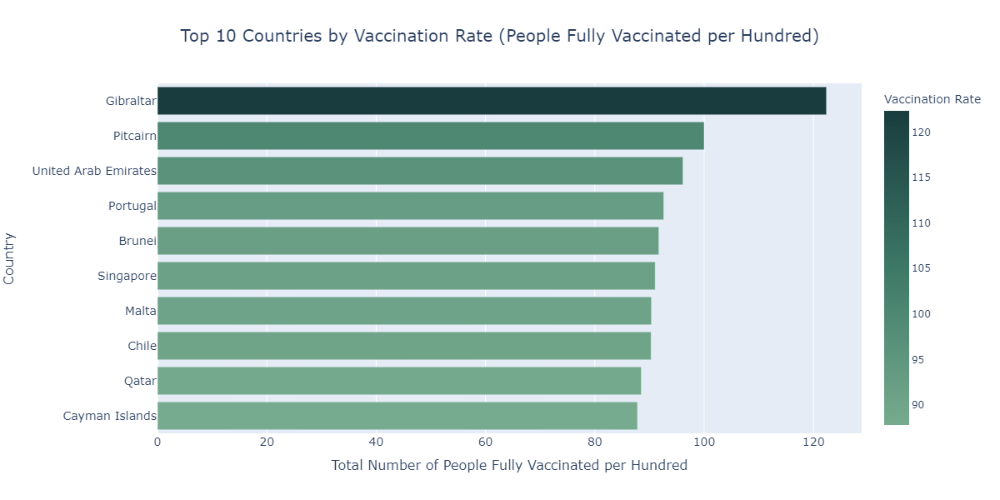
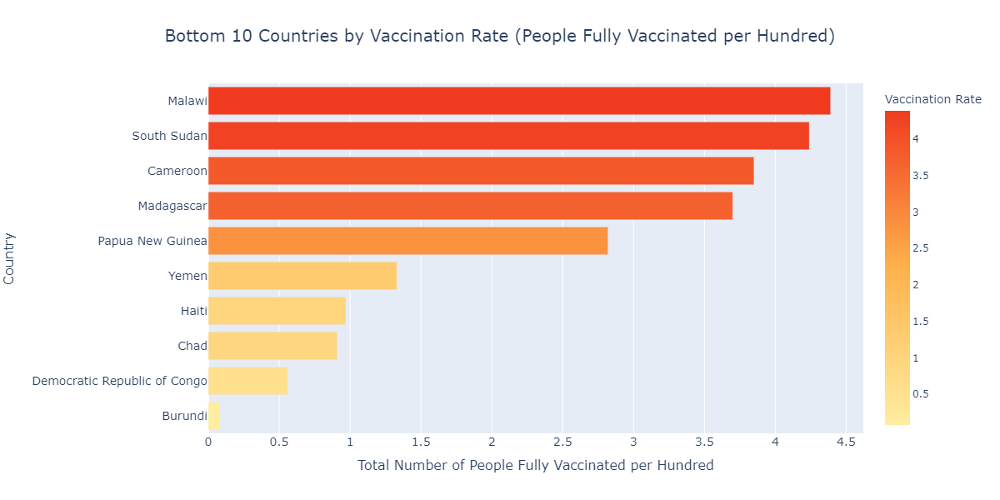

# Global COVID-19 Vaccination Data Analysis and Visualisation


[](https://colab.research.google.com/github/ChokZB/covid19_vaccination_analysis/blob/main/covid19_vaccination_analysis.ipynb)

A data-analysis project examining global COVID-19 vaccination progress through dataset cleaning, exploration, and visualisation.


---

## 🎯 Objectives

* Analyse worldwide vaccination trends and compare progress across regions and income groups.
* Clean, validate, and transform raw vaccination data to enable reliable insights.
* Produce visual representations that highlight coverage differences, rollout speed, and vaccine usage patterns.
* Incorporate external socioeconomic information to uncover broader relationships and disparities.


---

## 🗃️ Dataset

**File:** [`data/country_vaccinations.csv`](data/country_vaccinations.csv)


The dataset can be downloaded from Kaggle via this [link](https://www.kaggle.com/datasets/gpreda/covid-world-vaccination-progress).

The data in the dataset is a comprehensive collection of daily COVID-19 vaccination data by country, gathered from [Our World in Data’s GitHub repository](https://github.com/owid/covid-19-data). Country-level vaccination data is compiled into a single file. This file is then merged with location data files to include vaccination source information before the author uploads it on Kaggle.

The data contains the following information:

| No. | Attribute Name                      | Description                                                                                                            |
| --- | ----------------------------------- | ---------------------------------------------------------------------------------------------------------------------- |
| 1.  | country                             | Country for the vaccination data.                                                                                      |
| 2.  | iso_code                            | ISO code for the country.                                                                                              |
| 3.  | date                                | Date of the data entry.                                                                                                |
| 4.  | total_vaccinations                  | Absolute number of total immunisations.                                                                                |
| 5.  | people_vaccinated                   | Number of people who received at least one dose.                                                                       |
| 6.  | people_fully_vaccinated             | Number of people who received all doses prescribed by the vaccination protocol.                                        |
| 7.  | daily_vaccinations_raw              | Raw number of vaccinations administered for that date. This column will not be used in favour of `daily_vaccinations`. |
| 8.  | daily_vaccinations                  | Number of vaccinations administered for that date.                                                                     |
| 9.  | total_vaccinations_per_hundred      | Ratio (in percent) vaccination number and total population.                                                            |
| 10. | people_vaccinated_per_hundred       | Ratio (in percent) between vaccinated people and total population.                                                     |
| 11. | people_fully_vaccinated_per_hundred | Ratio (in percent) between fully vaccinated people and total population.                                               |
| 12. | daily_vaccinations_per_million      | Ratio (in parts per million) between daily vaccination number and total population.                                    |
| 13. | vaccines                            | Total number of vaccines used in the country.                                                                          |
| 14. | source_name                         | The source of the information.                                                                                         |
| 15. | source_website                      | The website of the information source.                                                                                 |


---

## 📡 External Data Sources & APIs

Additional contextual information is incorporated using two public APIs:

* **World Bank Country API**: Supplies country income-level classifications (Low, Lower Middle, Upper Middle, High). These classifications are merged into the dataset using ISO country codes to support comparative socioeconomic analysis.

* **REST Countries API**: Provides population figures for each country. A mapping layer is included to correct naming inconsistencies between the dataset and the API.

These external datasets enhance the main vaccination data by enabling population-based grouping and income-level comparisons.


---

## 📁 Project Structure

```
covid19_vaccination_analysis/
│
├── data/
│   └── country_vaccinations.csv                        # Dataset
│
├── figures/                                             # Folder for exported visualisations
│   ├── Top_10_Countries_by_Vaccination_Rate.png
│   ├── Bottom_10_Countries_by_Vaccination_Rate.png
│   ├── Global_Usage_of_Different_Vaccines.png
│   └── ...
│
├── .gitignore                                          # Files/folders excluded from Git
│
├── LICENSE                                             # MIT License
|
├── README.md                                           # Project overview and instructions
│
├── covid19_vaccination_analysis.ipynb                  # Main notebook
│
└── requirements.txt                                    # Dependency list for reproducibility
```


---

## 🔧 Setup & Execution

1. **Clone the repository**

   ```
   git clone https://github.com/ChokZB/covid19_vaccination_analysis.git
   ```

2. **Create a virtual environment (optional but recommended)**

   ```
   python -m venv venv
   source venv/bin/activate        # macOS / Linux
   venv\Scripts\activate           # Windows
   ```

3. **Install dependencies**

   Install all required packages using the provided `requirements.txt`:

   ```
   pip install -r requirements.txt
   ```

4. **Run the notebook**

   ```
   jupyter notebook covid19_vaccination_analysis.ipynb
   ```
    or open it directly in Colab.

    [](https://colab.research.google.com/github/ChokZB/covid19_vaccination_analysis/blob/main/covid19_vaccination_analysis.ipynb)


---

## 📷 Visual Outputs

Some previews of visualisations produced during the analysis, exported from the notebook for reference.







---

## 📈 Results & Insights

* Income-group comparisons, supported by classifications obtained from the World Bank API, reveal clear disparities in average vaccinations per hundred people, with higher-income economies consistently achieving substantially greater coverage than lower-income groups.

* Population-based analysis, informed by population figures retrieved through the REST Countries API, shows that smaller countries exhibit the widest spread in vaccination rates, whereas medium and large population groups display more stable and clustered distributions.

* Scatter-plot patterns indicate no strong linear association between the number of vaccine types administered and national vaccination coverage.

* Global daily vaccination activity reached its highest point on 27 June 2021, reflecting intensified rollout phases, strategic dose-interval adjustments, and improved supply during mid-2021.

* Vaccine-usage distributions highlight uneven reliance on specific vaccine brands, demonstrating varied national strategies and availability conditions across regions.


---

## 🧑‍💻 Author

**Chok Zu Bing**

GitHub: [@ChokZB](https://github.com/ChokZB)


---

## 🪪 Licence

This project is released under the [MIT License](LICENSE).